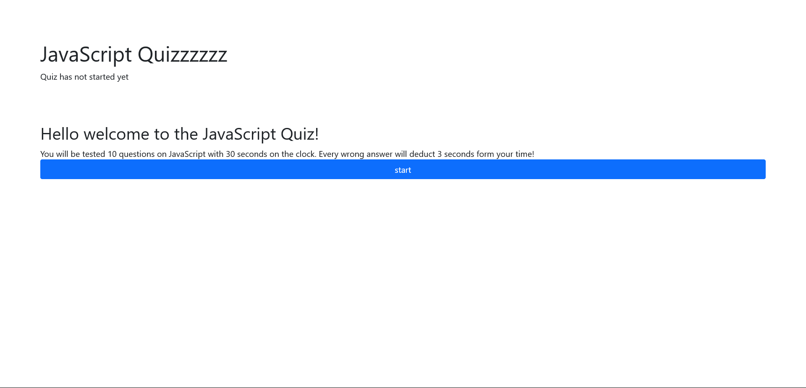

# Code Quiz

## Description

A plain website that tests your JavaScript knowledge! You will be shown a total of 10 multiple choice questions all relating to basic JavaScript. I went into the project wanting to familiarize myself with event listeners, data attributes, and storing data in local storage. This entire website is powered by a short JavaScript file that moves the player through 3 different sections of the test: welcome page, testing, and end page.

## Table of Contents

- [Description](#description)
- [Code Quiz Website Preview](#code-quiz-website-preview)
- [Website Structure](#website-structure)
- [Learnings](#learnings)
- [Conclusion](#conclusion)

## Code Quiz Website Preview

Click to Reveal

Click the preview to be redirected to the website!

## Website Structure

 The welcome and end pages are very basic and are landing pages for setting up the testing page. The testing page is where the majority of the work went into. I found that using div's was much easier than using buttons but that is subject to change in the future if I have time to improve on the accessibility of the website. The testing page was a really fun challenge since there were a lot of moving parts.

## Learnings

 Writing out my pseudocode was challenging since needed methods appeared after coding every few sections. What I have learned is that writing the code linearly is a much better practice than writing pseudocode that is just code but readable (English rather than syntactically correct). Finally I incorporated data attributes into the testing buttons to only deduct points once for the wrong answer and local browser storage so that the webpage remembers the high scores the user has accomplished in the past.

## Conclusion

This project was a exercise to get familiar with JavaScript and working with object oriented programming languages again after spending most of my time recently working with HTML and CSS. The logic for the script consisted of asking for user input, randomly generating character to add onto a string to return as a password, and looping through user inputs until they provided what was asked for (to cleanse user inputs). Ultimately this was a pretty straight forward project with generating a random number being the most difficult line. I found that having a pseudocode foundation was important to plan out how my code was going to function and keeping me organized.
